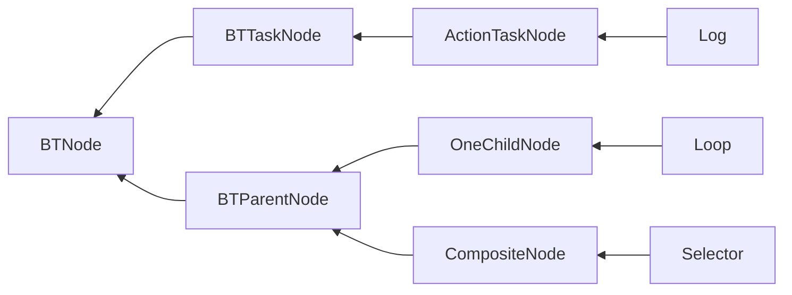

# BehaviorTree
https://robohub.org/introduction-to-behavior-trees/

## 驱动方式
- 事件驱动(event-driven)
- 轮询驱动(tick-driven)
    - root-leaf
    - last leaf 

Q：为什么不采用事件驱动(event-driven)行为树？  
A：实现起来太过于复杂，涉及到参数绑定值变化时没有办法处理。    
事件驱动实现基础时存在Blackboard，并且Blackboard SetValue触发更新。  
本库不存在Blackboard，绑定后没有SetValue，类似与Laze模式，每次取值时才计算值，无法触发事件，优点是不用手动SetValue。  
事件驱动优点是性能更高，缺点是因为没有tick所以需要service节点。  
轮询驱动优点是实现简单。  

- 从Start节点一路Tick到末端，目前才用的方式  
  优点是实现简单，容易理解
- 记录最后执行的末端节点，每次Tick最后的节点  
  优点是性能更好一点

# 装饰器
在UE中装饰器并没有保存在Task内部，在组合节点的子成员是一个新类，包含了装饰器和Task。

## 支持列表
- [ ] 使用异步API，比如父节点调用子节点等待结果，使用异步代替事件。Running可以使用异步代替。增加一个开关，异步模式还是Running模式。  
  实际实现时发现，使用异步实现起来更加繁琐。开销更大。所以暂时不采用这种方式。

