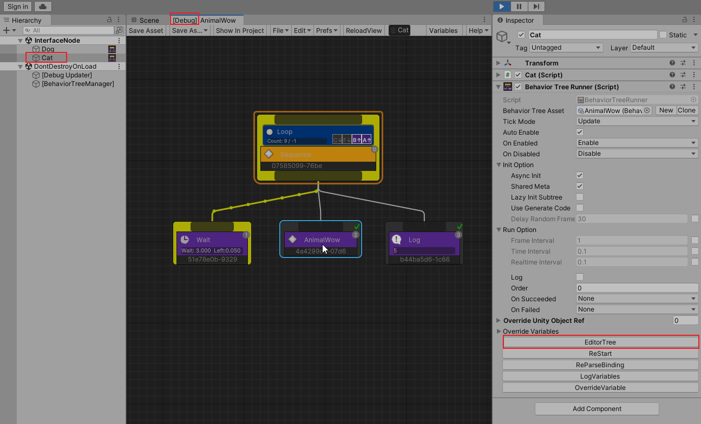

[TOC]

# 概述
行为树是一种用于实现怪物、Boss等非玩家控制角色复杂行为的工具。  
行为树是目前最常见的两种用来实现游戏角色AI的工具之一，另一种是有限状态机。  

Megumin AI BehaviorTree是为AAA和独立游戏设计的行为树编辑器插件。  
提供可视化编辑器，无需编写代码即可创建行为树。可以让设计师快速创建复杂的AI。  
解决了许多传统行为树编辑器的使用痛点，值得不满足于传统行为树编辑器的用户尝试。  

## Summary
为AAA和独立游戏设计的行为树插件。可以快速创建复杂的AI。

## Description
- 符合人类直觉的行为树架构，更加易于学习。  
  增加装饰器设计。条件装饰器使行为树用户界面更直观、更易读。  
- 非常易于扩展，仅需几行代码就可以自定义节点和UI样式。  
- 强大的数据绑定系统。可以在行为树中使用，也可以独立使用。  
- 完整的子树支持，编辑器支持多个窗口，可以同时编辑和Debug父树和子树。  
- 解决了许多传统行为树的使用痛点，值得不满足于传统行为树的用户尝试。  


[ [Samples](https://github.com/KumoKyaku/Megumin.AI.Samples) | [Feedback](https://github.com/KumoKyaku/Megumin.AI.Samples/issues) | [Wiki](https://github.com/KumoKyaku/Megumin.AI.Samples/wiki) | [Upgrade Guide](https://github.com/KumoKyaku/Megumin.AI.Samples/wiki/%E5%8D%87%E7%BA%A7%E6%8C%87%E5%AF%BC) | [QQ Group]() | [Discord](https://discord.gg/6VZbxZgTRU) ]

**注意：升级版本前请务必备份工程！！！**

# 安装

## 文件夹介绍
导入插件后，可以看到如下文件夹：  

- com.megumin.ai    
  AI模块的基础代码，标准接口定义
- com.megumin.ai.behaviortree    
  行为树运行时和编辑器代码
  + Samples    
    行为树示例
- com.megumin.perception    
  AI感知模块代码

+ com.megumin.binding    
  megumin系列插件的参数绑定模块代码
+ com.megumin.common    
  megumin系列插件的公共模块代码
+ com.megumin.reflection    
  megumin系列插件的反射模块代码
+ com.megumin.serialization    
  megumin系列插件的序列化模块代码

## 编辑器窗口介绍
在编辑器菜单Tools/Megumin/BehaviorTreeEditor，即可打开编辑器窗口。  


编辑器窗口说明：  

1. 保存行为树资产  双击按钮时强制保存
2. 另存行为树资产
3. 在项目窗口选择当前行为树资产
4. 文件菜单
5. 编辑菜单
6. 编辑器偏好菜单
7. 强制重新载入行为树
8. Debug实例对象
9. 参数表开关
10. 帮助按钮
11. 编辑器主界面
12. Inspector窗口，显示选中节点的详细信息。

## 创建行为树资产
在Project窗口，Create/Megumin/AI/BehaviorTreeAsset，创建行为树资产。双击行为树资产即可打开行为树编辑器。  


# 组件
BehaviorTreeRunner是执行行为树资产的组件。  
负责初始化行为树实例，并将行为树实例注册到Manager。  
可以设置行为树的具体执行参数。  


实例化参数 InitOption：  
- AsyncInit  
  使用多线程和异步实例化行为树实例。  
  缺点是不会在当前帧立刻完成并执行行为树。  
  并且初始化过程不能调用unity方法。  
  （WebGL平台下无效，不支持多线程）  
- SharedMeta  
  同一个行为树文件创建的实例，共享meta信息，主要是节点描述，节点坐标等运行时无关信息。  
- LazyInitSubtree  
  延迟实例化子树，第一次执行到子树节点时实例化。  
  默认值是false。
- UseGenerateCode  
  使用生成的代码实例化行为树。
+ DelayRandomFrame  
  实例化之后，开始执行树之前，延迟随机帧数。  
  当同时实例化大量行为树时，并设置了执行间隔时，可以将实例分散到多个帧执行，用来防止尖峰帧卡顿。  

如果根行为树使用多线程初始化，那么应该同时初始化子树，因为不会阻塞主线程。  
如果根行为树使用Unity主线程初始化，那么应该延迟初始化子树，尽量不要让大量计算发生在同一帧。  

运行参数 RunOption：  
+ FrameInterval  
  执行的帧间隔  
+ TimeInterval  
  执行的游戏时间间隔  
+ RealtimeInterval  
  执行的实时时间间隔  
- Log  
  打印节点切换等关键位置日志  
- Order  
  暂时没有作用，预留的参数。  
- OnSucceeded  
  当行为树执行成功时应该执行的操作，要不要重启行为树实例。  
- OnFailed  
  当行为树执行失败时应该执行的操作，要不要重启行为树实例。  


# 变量绑定
在行为树中的变量，可以绑定到与BehaviorTreeRunner存在于同一GameObject上的任何组件上。  
可以绑定属性或字段，也可以绑定到静态属性/字段。数据绑定可以是只读的，也可以是读写的。  

将变量绑定到一个成员时，任何时刻访问成员值，都是成员的最新值。  
这非常强大，它实现了行为树直接访问业务逻辑的属性，可以将对象的某个成员直接作为行为树的执行条件，而不需额外编码。

所有可绑定变量在Inspector上，都会有一个齿轮按钮。  
左键点击绑定按钮，会弹出同一GameObject上的含有的组件可绑定菜单。  


右键点击绑定按钮，会弹出当前项目所有的组件可绑定菜单，项目组件比较多时可能会卡顿。


注意：你可以将参数绑定到一个GameObject上不存在的组件的成员上，这在编辑器是合法的。因为这个组件可能在prefab上还不存在，需要在运行时动态添加。  
但你必须保证行为树开始初始化绑定前添加组件，或者在添加组件后手动调用行为树的参数绑定方法。  
即使最终绑定的组件不存在，也不会影响整个行为树执行。在访问这个变量时，可以返回类型的默认值。

# 节点
## 开始节点
可以将行为树的任意一个节点标记为开始节点。  
执行时从开始节点执行，忽略标记节点的父节点，开始节点执行完成时，视为整个行为树执行完成。

## 组合节点
- 序列节点（Sequence） 
  节点按从左到右的顺序执行其子节点。当其中一个子节点失败时，序列节点也将停止执行。如果有子节点失败，那么序列就会失败。如果该序列的所有子节点运行都成功执行，则序列节点成功。
- 选择节点（Selector） 
  节点按从左到右的顺序执行其子节点。当其中一个子节点执行成功时，选择器节点将停止执行。如果选择器的一个子节点成功运行，则选择器运行成功。如果选择器的所有子节点运行失败，则选择器运行失败。
- 平行节点（Parallel）
  同时执行其所有子项（不是多线程）。  
  根据FinishMode有不同的行为：  
  - AnyFailed  
    任意一个子节点失败，返回失败。
  - AnySucceeded  
    任意一个子节点成功，返回成功。
  - AnyCompleted  
    任意一个子节点完成，返回完成节点的结果。
  - AnySucceededWaitAll  
    等待所有子节点都完成，任意一个子节点成功，返回成功。
  - AnyFailedWaitAll  
    等待所有子节点都完成，任意一个子节点失败，返回失败。

## 行为节点
- 等待节点（Wait）
  等待指定时间秒数，然后返回成功。
- 日志节点（Log）
  生成日志，然后返回成功。

## 子树节点
子树节点可以引用另一个行为树文件。从子树的开始节点执行。  
父树的参数表重写子树的同名参数。  

## 写一个新的行为节点
创建一个新的行为节点，需要使用`Megumin.AI`和`Megumin.AI.BehaviorTree`命名空间。  

从`BTActionNode`基类继承，并重写`OnTick`方法。

```cs
using System;
using System.Collections.Generic;
using System.ComponentModel;
using Megumin.AI;
using Megumin.AI.BehaviorTree;

[Category("Action")]
public sealed class NewActionNode : BTActionNode
{
    public bool Success = true;
    protected override Status OnTick(BTNode from, object options = null)
    {
        return Success ? Status.Succeeded : Status.Failed;
    }
}
```

# 装饰器
可以将一个或多个装饰附加到一个行为树节点上。这个节点称为装饰器的物主节点。
装饰器为物主节点提供额外的功能，或者修改物主节点的完成结果。

- 冷却（Cooldown）  
  进入或者完成物主节点后，进入冷却。只有冷却完成才能再次进入物主节点。  
- 反转（Inverter）  
  反转物主节点的完成结果。  
- 循环（Loop）  
  循环指定次数执行物主节点。  
- 日志（DecoratorLog）  
  在物主节点指定行为发生时，生成日志。  

## 条件装饰器
条件装饰器是一种特殊的装饰器，用C↓表示，从上到下执行，用于判断节点能否进入。  
常用的条件装饰器包括：CheckBool，CheckInt，CheckFloat，CheckString，CheckLayer，CheckTrigger，CheckEvent，CheckGameObject，MouseEvent，KeyCodeEvent。

## 写一个新的条件装饰器
创建一个新的条件装饰，需要使用`Megumin.AI`和`Megumin.AI.BehaviorTree`命名空间。  

从`ConditionDecorator`基类继承，并重写`OnCheckCondition`方法。 
也可以从`CompareDecorator`基类继承，并重写`GetResult`和`GetCompareTo`方法。

```cs
using System;
using System.Collections.Generic;
using System.ComponentModel;
using Megumin.AI;
using Megumin.AI.BehaviorTree;

public sealed class NewCondition : ConditionDecorator
{
    protected override bool OnCheckCondition(object options = null)
    {
        return true;
    }
}

public sealed class CheckMyInt : CompareDecorator<int>
{
    public RefVar_Int Left;
    public RefVar_Int Right;

    public override int GetResult()
    {
        return Left;
    }

    public override int GetCompareTo()
    {
        return Right;
    }
}
```

# 条件终止
在节点已经开始执行，并且没有完成时，如果特定条件发生改变，终止当前正在运行的节点，切换到其他节点。  
两种终止类型：Self和LowerPriority。

Self终止下侧节点。  
  

LowerPriority终止右侧节点。  


Both同时终止右侧和下侧节点。  


# 节点特性  
用户自定义节点时，可以使用下列特性，改变节点在编辑器的默认行为。  
- [x] Category  
  设置编辑器中在创建节点时上下文菜单中的类别。  
- [x] DisplayName  
  设置编辑器中节点的自定义名字。  
- [x] Icon  
  设置编辑器中节点的自定义图标。  
- [x] Description  
  设置编辑器中节点的自定义描述。  
- [x] Tooltip  
  设置编辑器中节点的自定义提示信息。  
- [x] Color  
  设置编辑器中节点的自定义颜色。  
- [x] HelpURL  
  设置编辑器中节点的帮助文档链接。  
- [x] SerializationAlias  
  设置编辑器中节点的序列化别名。当自定义节点类名重命名时，这个特性非常有用。  
- [x] SetMemberByAttribute  
  反射赋值时查找这个特性，如果设置了回调函数，则使用回调函数对成员赋值。  
- [x] NonSerializedByMeguminAttribute  
  使用Megumin序列化时，忽略含有这个特性的成员。不会影响Unity默认序列化。  

# 调试
PlayMode时选择Gameobject，并点击EditorTree打开编辑器，会自动进入调试模式。  
调试模式的所有改动，都不会改变行为树资产，退出PlayMode时，改动也会消失。  


# 联系方式
- 邮箱： 479813005@qq.com
- 反馈： [Issues · KumoKyaku/Megumin.AI.Samples (github.com)](https://github.com/KumoKyaku/Megumin.AI.Samples/issues)
- QQ群： 
- Discord: https://discord.gg/6VZbxZgTRU


