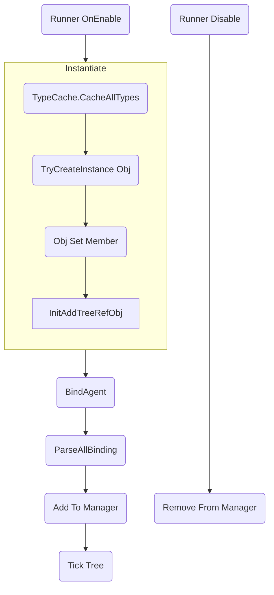

# 优化
这篇文档讨论如何处理尖峰帧卡顿(lag spike)。  

## 实例的执行过程

## 性能开销来自哪里
- 静态成员初始化
- 实例化对象
- 反射调用  
  目前反序列化是基于反射实现的，所以卡顿的主要原因是反射调用。  
- 轮询更新树

## 核心API
- TypeCache.CacheAllTypes  
  缓存AppDomain所有程序集所有类型全名，用于加速后续反序列化时类型查找。  
- TypeCache.TryMakeArrayType / TypeCache.TryMakeGenericType  
  生成泛型特化类型，这些类型再程序集里不存在，只有运行时才存在。  
- CreateDelegate  
  将字段属性方法封装为委托。  
- Activator.CreateInstance  
  反射创建实例对象。  
- TrySetMemberValue  
  反射为对象成员赋值。  

## 为什么出现尖峰帧卡顿(lag spike)
在.NET中，反射第一次调用时很慢，第二次就足够快了。所以第一次初始化比较慢是预期之中的。

第一次初始化过程中，会有很多反射调用被触发。  
在插件的架构设计中，不能要求用户在使用之前，必须要执行若干初始化代码。  
在使用上必须是开箱即用的，保证艺术家和独立开发者可以在不修改代码的情况下工作。

## 需要处理的位置

- 全局第一次实例化
- 树实例第一次实例化
- 节点类型第一次实例化
- 更新行为树

## 优化思路
- 优化代码架构和实现方法，减小性能开销  
- 将耗时大的执行过程分散到多个帧执行（预热和分帧）  
- 多线程  

具体方法：
- 提前访问静态类型，触发静态成员初始化。例如TypeHelper。 
  

# 参考链接
- [Why is reflection slow?](https://mattwarren.org/2016/12/14/Why-is-Reflection-slow/)

