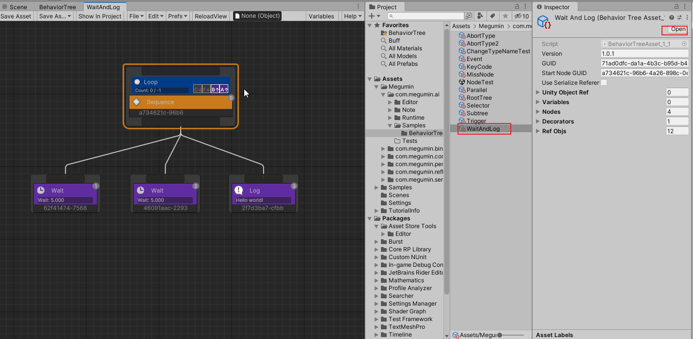

[TOC]

# Overview
BehaviorTree is a tool used to implement complex behaviors that non-players control characters such as monsters and bosses.  
BehaviorTree are currently one of the two most common tools used to implement game character AI, the other being finite state machines.  

Megumin AI BehaviorTree is a behavior tree editor plugin designed for AAA and indie games.  
Provides a visual editor to create behavior trees without writing code. Allows designers to quickly create complex AI.  
It solves many pain points in the use of traditional behavior trees editor, and it is worth trying for users who are not satisfied with traditional behavior trees editor.  

# Installation

## Folder description
After importing the plugin, you can see the following folders:  

- com.megumin.ai    
  Behavior tree runtime and editor code
  + Samples/BehaviorTree    
    Example of a behavior tree asset
- com.megumin.perception    
  AI perception module code
+ com.megumin.binding    
  The parameter binding module code of the Megumin-Plugins。
+ com.megumin.common    
  The public module code of the Megumin-Plugins。
+ com.megumin.reflection    
  The reflection module code of the Megumin-Plugins。
+ com.megumin.serialization    
  The reflection module code of the Megumin-Plugins。

## EditorWindow Introduction
On the editor menu Tools/Megumin/BehaviorTreeEditor, you can open the editor window.  


Editor window description:  

1. Save BehaviorTree Asset. Force save when you double-click the button.
2. Save As BehaviorTree Asset
3. Select the current behavior tree asset in the Projects window
4. File menu
5. Edit menu
6. Editor preferences menu
7. Force reload the behavior tree
8. Debug instance object
9. Variables-table view toggle
10. Help button
11. Editor main view
12. Unity Inspector window, which displays the details of the selected node.

## Create a BehaviorTree asset
In the Project window, Create/Megumin/AI/BehaviorTreeAsset creates a behavior tree asset. Double-click a Behavior Tree asset to open the Behavior Tree Editor.  



# Component
BehaviorTreeRunner is the component that executes the Behavior Tree asset.  
Responsible for initializing the Behavior Tree instance and registering the Behavior Tree instance to the Manager.  
You can set specific execution parameters for the behavior tree.  


InitOption:
- AsyncInit  
  Uses multi-threaded asynchronous instantiation of the behavior tree instance.  
  The disadvantage is that the behavior tree is not completed and executed immediately at the current frame.  
  And the initialization process cannot call the Unity method.
- SharedMeta  
  Same behavior tree file in SharedMeta share meta information, mainly node descriptions, node coordinates and other runtime-independent information.  
- LazyInitSubtree  
  Delayed instantiation of the subtree, instantiated on the first execution to the subtree node.
  The default value is false.
- UseGenerateCode  
  Instantiates the behavior tree using the generated code.
+ DelayRandomFrame  
  Instantiation, delay random frames before starting the execution tree.  
  When a large number of behavior trees are instantiated at the same time and the execution interval is set, the instances can be spread across multiple frame executions to prevent spike frame stuttering.  

If the root behavior tree uses multithreaded initialization, the subtree should be initialized at the same time because the main thread is not blocked.  
If the root behavior tree is initialized using the Unity main thread, you should lazilate initialize the subtree and try not to have a lot of computation happen in the same frame.

RunOption：  
+ FrameInterval  
  Frame execution interval  
+ TimeInterval  
  Game-time execution interval  
+ RealtimeInterval  
  Real-time execution interval  
- Log  
  prints logs  
- Order  
  has no effect for the time being, reserved parameters.  
- OnSucceeded  
  What should be done when the behavior tree is executed successfully, whether to restart the tree.  
- OnFailed  
  What should be done when the behavior tree execution fails, whether to restart the tree.  


# Variable Binding
The variables in the behavior tree can be bound to any component that exists on the same GameObject as BehaviorTreeRunner.  
You can bind a property or field, or you can bind to a static property/field. The data binding can be read-only or read-write.  

When you bind a variable to a member, the member's value is accessed at any time and is the latest value of the member.  
This is very powerful because it implements the behavior tree to directly access the properties of the game logic, and can make a member of an object directly a condition for the execution of the behavior tree without additional coding.  

All bindable variables on the Inspector will have a gear button.  
Left-click the bind button to bring up the bindable menu of components contained on the same GameObject.  


Right-click the bind button, the bindable menu of all components of the current project will pop up, and the project may freeze when there are more components.  


Note: You can bind parameters to members of a component that does not exist on the GameObject, which is legal in the editor. Because this component may not yet exist on prefab, it needs to be added dynamically at runtime.  
However, you must ensure that you add components before the behavior tree starts initializing bindings, or manually call the behavior tree's parameter binding functions after adding components.  
Even if the final bound component does not exist, it does not affect the entire behavior tree execution. When accessing this variable, you can return the default value of the type.  

# 节点
## 开始节点
可以将行为树的任意一个节点标记为开始节点。  
执行时从开始节点执行，忽略标记节点的父节点，开始节点执行完成时，视为整个行为树执行完成。

## 组合节点
- 顺序节点（Sequence） 
  节点按从左到右的顺序执行其子节点。当其中一个子节点失败时，序列节点也将停止执行。如果有子节点失败，那么序列就会失败。如果该序列的所有子节点运行都成功执行，则序列节点成功。
- 选择节点（Selector） 
  节点按从左到右的顺序执行其子节点。当其中一个子节点执行成功时，选择器节点将停止执行。如果选择器的一个子节点成功运行，则选择器运行成功。如果选择器的所有子节点运行失败，则选择器运行失败。
- 平行节点（Parallel）
  同时执行其所有子项（不是多线程）。  
  根据FinishMode有不同的行为：  
  - AnyFailed  
    任意一个子节点失败，返回失败。
  - AnySucceeded  
    任意一个子节点成功，返回成功。
  - AnyCompleted  
    任意一个子节点完成，返回完成节点的结果。
  - AnySucceededWaitAll  
    等待所有子节点都完成，任意一个子节点成功，返回成功。
  - AnyFailedWaitAll  
    等待所有子节点都完成，任意一个子节点失败，返回失败。

## 行为节点
- 等待节点（Wait）
  等待指定时间秒数，然后返回成功。
- 日志节点（Log）
  生成日志，然后返回成功。

## 子树节点
子树节点可以引用另一个行为树。从子树的开始节点执行。  
父数的参数表重写子树的同名参数。  

## 写一个新的行为节点
创建一个新的行为节点，需要引入Megumin.GameFramework.AI和Megumin.GameFramework.AI.BehaviorTree命名空间。  

从BTActionNode基类继承，并重写OnTick函数。

```cs
using System;
using System.Collections.Generic;
using System.ComponentModel;
using Megumin.GameFramework.AI;
using Megumin.GameFramework.AI.BehaviorTree;

[Category("Action")]
public sealed class NewActionNode : BTActionNode
{
    public bool Success = true;
    protected override Status OnTick(BTNode from, object options = null)
    {
        return Success ? Status.Succeeded : Status.Failed;
    }
}
```

# 装饰器
可以将一个或多个装饰附加到一个行为树节点上。这个节点称为装饰器的物主节点。
装饰器为物主节点提供额外的功能，或者修改物主节点的完成结果。

- 冷却（Cooldown）
  进入或者完成物主节点后，进入冷却。只有冷却完成才能再次进入物主节点。
- 反转（Inverter）
  反转物主节点的完成结果。
- 循环（Loop）
  循环指定次数执行物主节点。
- 日志（DecoratorLog）
  在物主节点指定行为发生时，生成日志。

## 条件装饰器
条件装饰器是一种特殊的装饰器，用C↓表示，从上到下执行，用于判断节点能否进入。
常用的条件装饰器包括：CheckBool，CheckInt，CheckFloat，CheckString，CheckLayer，CheckTrigger，CheckEvent，CheckGameObject，MouseEvent，KeyCodeEvent。

## 写一个新的条件装饰器
创建一个新的条件装饰，需要引入Megumin.GameFramework.AI和Megumin.GameFramework.AI.BehaviorTree命名空间。  

从ConditionDecorator基类继承，并重写OnCheckCondition函数。 
也可以从CompareDecorator基类继承，并重写GetResult和GetCompareTo函数。

```cs
using System;
using System.Collections.Generic;
using System.ComponentModel;
using Megumin.GameFramework.AI;
using Megumin.GameFramework.AI.BehaviorTree;

public sealed class NewCondition : ConditionDecorator
{
    protected override bool OnCheckCondition(object options = null)
    {
        return true;
    }
}

public sealed class CheckMyInt : CompareDecorator<int>
{
    public RefVar_Int Left;
    public RefVar_Int Right;

    public override int GetResult()
    {
        return Left;
    }

    public override int GetCompareTo()
    {
        return Right;
    }
}
```

# 条件终止
在节点已经开始执行，并且没有完成时，如果特定条件发生改变，终止当前正在运行的节点，切换到其他节点。  
两种终止类型：Self和LowerPriority。

Self终止下侧节点。  
  

LowerPriority终止右侧节点。  


Both同时终止右侧和下侧节点。  


# 节点特性
用户自定义节点时，可以使用下列特性，改变节点在编辑器的默认行为。
- [x] Category
  设置编辑器中在创建节点时上下文菜单中的类别。
- [x] DisplayName
  设置编辑器中显示节点的自定义名字。
- [x] Icon
  设置编辑器中显示节点的自定义图标。
- [x] Description
  设置编辑器中显示节点的自定义描述。
- [x] Tooltip
  设置编辑器中显示节点的自定义提示信息。
- [x] Color
  设置编辑器中节点的自定义颜色。
- [x] HelpURL
  设置编辑器中节点的帮助文档链接。
- [x] SerializationAlias
  设置编辑器中节点的序列化别名。当自定义节点类名重名时，这个特性非常有用。

# 调试
运行时选择Gameobject，并点击EditorTree打开编辑器，会自动进入调试模式。  
调试模式的所有改动，都不会改变行为树资产，停止Play模式时，改动也会消失。  


# 联系方式
- 邮箱：479813005@qq.com
- 反馈：[Issues · KumoKyaku/Megumin.GameFramework.AI.Samples (github.com)](https://github.com/KumoKyaku/Megumin.GameFramework.AI.Samples/issues)
- QQ群：[812318008](http://qm.qq.com/cgi-bin/qm/qr?_wv=1027&k=I_oDoO-b1yQs1Em-QvRPG4ZN21RuYM3G&authKey=7TZUwLSCvvCTWo2hnDUwRtlhd733Rc%2BHshrIF%2Fm7p2v7Yo5hxN3hZdWPFnIIIQlf&noverify=0&group_code=812318008)


