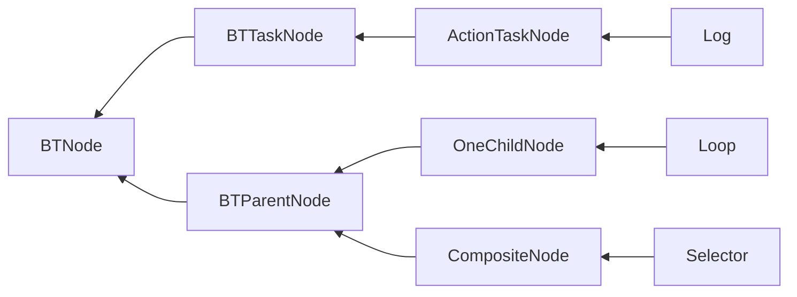

# BehaviorTree
https://robohub.org/introduction-to-behavior-trees/

## 驱动方式
- 事件驱动(event-driven)
- 轮询驱动(tick-driven)
    - root-leaf
    - last leaf 

Q：为什么不采用事件驱动(event-driven)行为树？  
A：实现起来太过于复杂，涉及到参数绑定值变化时没有办法处理。    
事件驱动实现基础时存在Blackboard，并且Blackboard SetValue触发更新。  
本库不存在Blackboard，绑定后没有SetValue，类似与Laze模式，每次取值时才计算值，无法触发事件，优点是不用手动SetValue。  
事件驱动优点是性能更高，缺点是因为没有tick所以需要service节点。  
轮询驱动优点是实现简单。  

- 从Start节点一路Tick到末端，目前才用的方式  
  优点是实现简单，容易理解
- 记录最后执行的末端节点，每次Tick最后的节点  
  优点是性能更好一点

# 装饰器
在UE中装饰器并没有保存在Task内部，在组合节点的子成员是一个新类，包含了装饰器和Task。
而本库才用方式是装饰器放在Task内部，并认为装饰器是Task的一部分。

在状态机中，条件节点从来就不是一个状态，我认为行为树将条件节点作为执行节点放在树中是一个失败设计。

- 先判断后执行
- 先执行后判断

# Abort
Abort 理解为当前节点最后一次不调用Tick函数的Tick，视为最后通牒。  
当Abort发生时，递归调用子节点，Abort执行OnAbort Exit BackDerators。
最终由子到父，依次退出。

# 异步
使用异步代替Running。尝试发现，使用异步就不应该tick驱动，只有事件驱动才能完全发挥异步的效果。   
这与参数绑定是相互冲突的设计。如果强行使用异步，就要增加一个绑定参数求解器，然后不停的Tick，当参数值发生改变时，发送事件到行为树，模拟事件驱动。

## 支持列表
- [ ] 使用异步API，比如父节点调用子节点等待结果，使用异步代替事件。Running可以使用异步代替。增加一个开关，异步模式还是Running模式。  
  实际实现时发现，使用异步实现起来更加繁琐。开销更大。所以暂时不采用这种方式。
- [ ] 条件装饰器 用C↓表示，从上到下执行 用于判断节点能否进入  
- [ ] 前置装饰器 用F↓表示，从上到下执行 在进入节点前调用
- [ ] 后置装饰器 用B↑表示，从下到上执行 在退出节点后调用
- [ ] 中断装饰器 用A↑表示，从下到上执行 在中断节点发生时退出节点后调用
- [ ] 运行时编辑器/行为树查看器。（目前GraphView只支持编辑器，等unity运行时支持时迁移）

