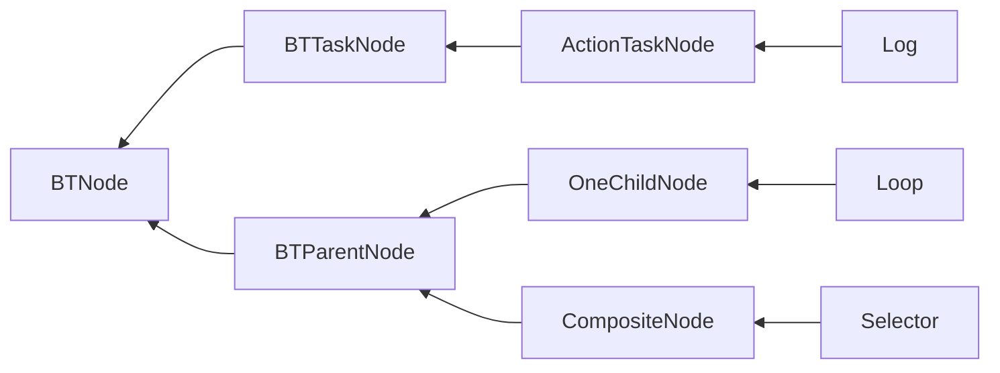

# BehaviorTree
https://robohub.org/introduction-to-behavior-trees/

# 快速入门
## 基础功能

* [x] 基础节点库实现
  * [ ] Relay节点
  * [ ] Placeholder节点

- [x] 增加/删除节点
- [x] 连接/断开节点
- [x] 复制/粘贴节点
- [x] 移动子节点时重新排序子节点

+ [x] 公开参数绑定
+ [x] List Array ~~Dictionary~~
+ [x] 最多2层的嵌套泛型
+ [ ] TreeElement循环引用。Task引用其他Task。

- [ ] 笔记节点StickyNote
- [ ] 组合Group
- [ ] 子树

* [x] 有未保存改动时关闭编辑器进行提示
* [x] Undo/Redo 
* [x] 通过节点打开cs文件
* [ ] 通过节点打开节点View文件
* [ ] 节点序号

- [x] 保存为ScriptObject资产
- [ ] 保存为Json资产
- [x] 自动使用编辑器打开资产文件
- [ ] 生成行为树代码，消除反射，消除绑定

+ [x] 保存编辑器用户偏好设置
+ [ ] 编辑器Log可选设置
+ [ ] 多语言Log

- [ ] 调试
- [ ] 远程调试
- [ ] 游戏内实时编辑器/行为树查看器。（目前GraphView只支持编辑器，等unity realtime支持时迁移）

## 支持的Attribute
- [x] Category
- [x] Icon
- [x] HelpURL
- [x] Description
- [x] Tooltip
- [x] Color

# 实现细节
## 架构图

## 装饰器
在UE中装饰器并没有保存在Task内部，在组合节点的子成员是一个新类，包含了装饰器和Task。  

而本库才用方式是装饰器放在Task内部，并认为装饰器是Task的一部分。
依据是 在状态机中，条件节点从来就不是一个状态，而是一个过渡，过渡不是一等成员，不能独立存在与状态机中，只能依附于节点。  

我认为行为树将条件节点作为执行节点放在树中是一个失败设计。

采用了装饰器放在Task内部的设计，那么：  
1. 先判断后进入Task （依据是 装饰器等价于其他行为树中的条件节点，只有经过了条件节点，才能到达Action节点）
2. 先进入Task后判断 （依据是 如果不进入Task，那么不应该访问Task内部内容）   

哪种更合理？

目前才用第一种。

于此同时，装饰器等价于其他行为树中的条件节点，控制节点。所以装饰器数据结构上与Note相似，同样含有GUID等成员。
## 特色功能
- [ ] 使用异步API，比如父节点调用子节点等待结果，使用异步代替事件。Running可以使用异步代替。增加一个开关，异步模式还是Running模式。  
  实际实现时发现，使用异步实现起来更加繁琐。开销更大。所以暂时不采用这种方式。
- [ ] 条件装饰器 用C↓表示，从上到下执行 用于判断节点能否进入  
- [ ] 前置装饰器 用F↓表示，从上到下执行 在进入节点前调用
- [ ] 后置装饰器 用B↑表示，从下到上执行 在退出节点后调用
- [ ] 中断装饰器 用A↑表示，从下到上执行 在中断节点发生时退出节点后调用

## Abort
Abort 理解为当前节点最后一次不调用Tick函数的Tick，视为最后通牒。  
当Abort发生时，递归调用子节点，Abort执行OnAbort Exit BackDerators。
最终由子到父，依次退出。

## 多态序列化和泛型序列化

- 多态序列化可以使用，但是如果注意，如果直接清楚序列化对象，重新赋值新对象时，rid会改变。  
  直接修改原对象时rid不会改变。
- 泛型序列化unity2023才开始支持。插件主要支持版本还是2021，现阶段不能依赖于这个功能。所以还是要泛型特化。

## 参数绑定
参数绑定涉及到的4个功能是逐步递进的。

1. 包含一个基础值，作为普通成员来使用。
2. 包含一个Path，纪录绑定到Agent的某个组件的成员。  
   包含一个ParseMode，用于在解析绑定失败时的行为，包括Log，抛出异常，回退到基础值，回退到类型默认值。
3. 包含一个Name，可以存放到参数表集合中，也可以在多个节点上共享。也可以看作这个成员值引用了一个参数表中的值。
4. AutoConvert，存放一个参数引用，引用的参数类型可以和声明类型不一致，使用自动转换器来匹配。

节点的成员值可以声明为这4种。  
如果使用1和2的类型，序列化是直接序列化到节点本身的，等同于内嵌到节点的，不与节点外界发生关系。  
如果使用3和4的类型，参数是序列化到树的参数表中的，在节点本身只序列为引用Name，实例化时通过搜索参数表中的参数，赋值给成员。

## AutoConvert
自动类型转换存在2个部分。
- 参数实例Path可以绑定到与参数声明类型不同的Agent的某个组件的成员。  
- 节点成员值可以引用参数表中与成员声明类型不同的参数实例。  

显而易见的是，转换次数越多，性能越低。

## 概率与冷却

## 环形拓扑和菱形拓扑
- 环形拓扑本质上已经非常接近分层状态机了，每个组合节点都可以看作一个状态机的层。
- 菱形拓扑可以避免常用逻辑在图中多次复制。  

运行时的树是没用连接限制的。能否环形拓扑和菱形拓扑是编辑器的限制。用户可以手动编写文件。
超出树形拓扑会造成蜘蛛网一样的图，失去可读性。用户自行取舍。

## 驱动方式
- 事件驱动(event-driven)
- 轮询驱动(tick-driven)
    - root-leaf
    - last leaf 

Q：为什么不采用事件驱动(event-driven)行为树？  
A：实现起来太过于复杂，涉及到参数绑定值变化时没有办法处理。    
事件驱动实现基础时存在Blackboard，并且Blackboard SetValue触发更新。  
本库不存在Blackboard，绑定后没有SetValue，类似与Laze模式，每次取值时才计算值，无法触发事件，优点是不用手动SetValue。  
事件驱动优点是性能更高，缺点是因为没有tick所以需要service节点。  
轮询驱动优点是实现简单。  

- 从Start节点一路Tick到末端，目前才用的方式  
  优点是实现简单，容易理解
- 记录最后执行的末端节点，每次Tick最后的节点  
  优点是性能更好一点

## 异步
使用异步代替Running。尝试发现，使用异步就不应该tick驱动，只有事件驱动才能完全发挥异步的效果。   
这与参数绑定是相互冲突的设计。如果强行使用异步，就要增加一个绑定参数求解器，然后不停的Tick，当参数值发生改变时，发送事件到行为树，模拟事件驱动。

## 状态切换
Q：节点完成后应该`立刻进入下一个节点`还是`下一次tick才进入下一个节点`？  
A：采用`立刻进入下一个节点`的方案。
- 必须保证有一个叶子节点为running状态。  
  如果下一个tick才切换，会导致当前tick，当前节点完成，下一个节点未开始运行。不符合直觉。
- 类比状态机，状态机中不允许某一时刻处于2个状态夹缝状态，总是立刻进入下一个状态。
- 装饰器等同于常规行为树的叶子节点。而且装饰器很难实现下一次tick才进入下一个装饰器。  
  为了保证装饰器和叶子节点的一致性，统一为立刻进入下一个节点。

---
---
# 参考连接

# 特别鸣谢

