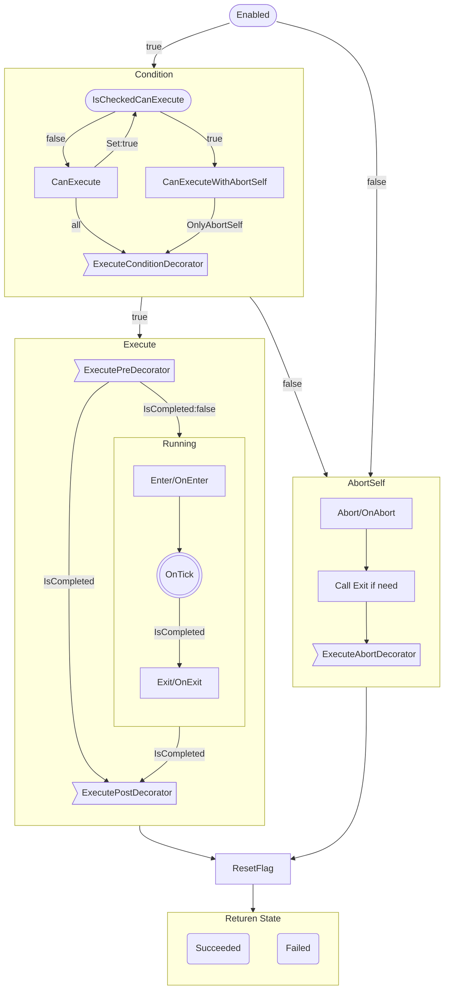

# BehaviorTree

# 快速入门
## 基础功能

* [x] 基础节点库实现
  * [ ] 为Unity默认组件生成节点
  * [ ] 视觉听觉感知组件和节点

+ [x] 公开参数绑定
+ [x] List Array ~~Dictionary~~
+ [x] 最多2层的嵌套泛型
+ [x] TreeElement循环引用。Task引用其他Task。

- [ ] 笔记节点StickyNote
- [ ] 组合Group
- [ ] 子树

+ [x] 增加/删除节点
+ [x] 连接/断开节点
+ [x] 复制/粘贴节点
+ [x] 移动子节点时重新排序子节点

* [x] 有未保存改动时关闭编辑器进行提示
* [x] Undo/Redo 
* [x] 通过节点打开cs文件
* [ ] 通过节点打开节点View文件
* [x] 节点序号

+ [ ] 选中节点时，提示条件终止可影响的节点

* [ ] TwoChild节点创建特有的节点View

- [x] 保存为ScriptObject文件
- [ ] 保存为Json文件
- [x] 自动使用编辑器打开文件
- [ ] 生成行为树代码，消除反射，消除绑定
- [ ] 扫描所有行为树用到的类型，生成TypeCache.Hot静态方法代码。

+ [x] 保存编辑器用户偏好设置
+ [ ] 编辑器Log可选设置
+ [ ] 多语言Log

- [x] 每个行为树文件和实例独立编辑器窗口
- [x] 调试
- [x] 支持多个实例同时调试
- [ ] 远程调试
- [ ] 游戏内实时编辑器/行为树查看器。（目前GraphView只支持编辑器，等unity realtime支持时迁移）

## 支持的Attribute
- [x] Category
- [x] DisplayName
- [x] Icon
- [x] HelpURL
- [x] Description
- [x] Tooltip
- [x] Color
- [x] SerializationAlias

# 实现细节
## 架构图


## 节点函数的执行顺序
Tick函数内部大致调用过程，具体细节请阅读源码。



## 装饰器

在UE中装饰器并没有保存在Task内部，在组合节点的子成员是一个新类，包含了装饰器和Task。  

而本库才用方式是装饰器放在Task内部，并认为装饰器是Task的一部分。
依据是 在状态机中，条件节点从来就不是一个状态，而是一个过渡，过渡不是一等成员，不能独立存在与状态机中，只能依附于节点。  

我认为行为树将条件节点作为执行节点放在树中是一个失败设计。

采用了装饰器放在Task内部的设计，那么：  
1. 先判断后进入Task （依据是 装饰器等价于其他行为树中的条件节点，只有经过了条件节点，才能到达Action节点）
2. 先进入Task后判断 （依据是 如果不进入Task，那么不应该访问Task内部内容）   

哪种更合理？

目前才用第一种。

于此同时，装饰器等价于其他行为树中的条件节点，控制节点。所以装饰器数据结构上与Note相似，同样含有GUID等成员。

- [x] `条件装饰器` 用C↓表示，从上到下执行 用于判断节点能否进入  
- [x] `前置装饰器` 用F↓表示，从上到下执行 在进入节点前调用  
- [x] `后置装饰器` 用B↑表示，从下到上执行 在退出节点后调用  
- [x] `终止装饰器` 用A↑表示，从下到上执行 在终止节点发生时退出节点后调用  

+ 如果`条件装饰器`没有通过，则不会执行节点。前置装饰器，后置装饰器，终止装饰器都不会被执行。  
+ `后置装饰器`和`终止装饰器` 不会被同时执行。  
  但是节点本身的OnAbort OnExit都会被执行。  
  Abort时调用顺序 OnAbort --> (如果执行过Enter)Exit --> `终止装饰器`  

## 子树
使用Subtree节点，可以引用另一个行为树文件，作为子树使用。  
- 内联  
  将子树节点的行为树节点内联到当前树中，并使用子树的开始节点，取代子树节点。  
  内联是所有子树节点的GUID都会更新为新值，防止GUID冲突。  
- 导出  
  选中一个节点，将该节点和它的子节点导出为一个新的行为树。  
  所有导出的节点GUID都会更新为新值，防止GUID冲突。  
  主要是防止用户导出后又进行Undo操作，会导致出现相同GUID的节点。  
  由于架构设计原因，无法分析参数表与节点的引用关系，引用的参数表参数不会跟随导出到新树中。  

`注意：内联和导出都是高危操作，非常容易对行为树文件造成不可逆更改。强烈建议在操作前使用版本管理工具。`

## 特色功能
- [ ] 使用异步API，比如父节点调用子节点等待结果，使用异步代替事件。Running可以使用异步代替。增加一个开关，异步模式还是Running模式。  
  实际实现时发现，使用异步实现起来更加繁琐。开销更大。所以暂时不采用这种方式。

## 平行节点Parallel
根据FinishMode有不同的行为
- AnyFailed  
  任意一个子节点失败，返回失败。
- AnySucceeded  
  任意一个子节点成功，返回成功。
- AnyCompleted  
  任意一个子节点完成，返回完成节点的结果。
- AnySucceededWaitAll  
  等待所有子节点都完成，任意一个子节点成功，返回成功。
- AnyFailedWaitAll
  等待所有子节点都完成，任意一个子节点失败，返回失败。

## Abort
Abort 理解为当前节点最后一次不调用Tick函数的Tick，视为最后通牒。  
当Abort发生时，递归调用子节点，Abort执行OnAbort Exit BackDerators。
最终由子到父，依次退出。

## 多态序列化和泛型序列化

- 多态序列化可以使用，但是如果注意，如果直接清楚序列化对象，重新赋值新对象时，rid会改变。  
  直接修改原对象时rid不会改变。
- 泛型序列化unity2023才开始支持。插件主要支持版本还是2021，现阶段不能依赖于这个功能。所以还是要泛型特化。

## 参数绑定
参数绑定涉及到的4个功能是逐步递进的。

1. 包含一个基础值，作为普通成员来使用。
2. 包含一个Path，纪录绑定到Agent的某个组件的成员。  
   包含一个ParseMode，用于在解析绑定失败时的行为，包括Log，抛出异常，回退到基础值，回退到类型默认值。
3. 包含一个Name，可以存放到参数表集合中，也可以在多个节点上共享。也可以看作这个成员值引用了一个参数表中的值。
4. AutoConvert，存放一个参数引用，引用的参数类型可以和声明类型不一致，使用自动转换器来匹配。

节点的成员值可以声明为这4种。  
如果使用1和2的类型，序列化是直接序列化到节点本身的，等同于内嵌到节点的，不与节点外界发生关系。  
如果使用3和4的类型，参数是序列化到树的参数表中的，在节点本身只序列为引用Name，实例化时通过搜索参数表中的参数，赋值给成员。

## AutoConvert
自动类型转换存在2个部分。
- 参数实例Path可以绑定到与参数声明类型不同的Agent的某个组件的成员。  
- 节点成员值可以引用参数表中与成员声明类型不同的参数实例。  

显而易见的是，转换次数越多，性能越低。

## 类名变更
- 序列化成员更改命名。保证仍能反序列化成功。 
    - 支持FormerlySerializedAsAttribute特性
    - 支持SerializationAliasAttribute特性
- 节点更换类名   
    - 使用SerializationAliasAttribute特性标记在类型上，注意别名一定是旧的类型全名，包含命名空间。  
    编辑器会自动查找SerializationAlias保证旧的文件仍能反序列化成功。重新保存后变更为新名字。  
    - 或者手动写一个静态函数，在反序列化前使用TypeCache.HotType设置别名。   

查找特性比较耗时，推荐更换命名后，重新保存下已有的行为树文件，将名字更新。  
如果需要运行时解析旧名字，同理，在游戏开始时，反序列化之前使用TypeCache.HotType设置别名。

## 节点引用
可以在节点中声明引用含有Serializable特性的节点。
使用BindingPathSetterAttribute，则可以在Inspector中选择树种的节点引用。

## 概率与冷却

## 环形拓扑和菱形拓扑
- 环形拓扑本质上已经非常接近分层状态机了，每个组合节点都可以看作一个状态机的层。
- 菱形拓扑可以避免常用逻辑在图中多次复制。  

运行时的树是没用连接限制的。能否环形拓扑和菱形拓扑是编辑器的限制。用户可以手动编写文件。
超出树形拓扑会造成蜘蛛网一样的图，失去可读性。用户自行取舍。

## 驱动方式
- 事件驱动(event-driven)
- 轮询驱动(tick-driven)
    - root-leaf
    - last leaf 

Q：为什么不采用事件驱动(event-driven)行为树？  
A：实现起来太过于复杂，涉及到参数绑定值变化时没有办法处理。    
事件驱动实现基础时存在Blackboard，并且Blackboard SetValue触发更新。  
本库不存在Blackboard，绑定后没有SetValue，类似与Laze模式，每次取值时才计算值，无法触发事件，优点是不用手动SetValue。  
事件驱动优点是性能更高，缺点是因为没有tick所以需要service节点。  
轮询驱动优点是实现简单。  

- 从Start节点一路Tick到末端，目前才用的方式  
  优点是实现简单，容易理解
- 记录最后执行的末端节点，每次Tick最后的节点  
  优点是性能更好一点

## 异步
使用异步代替Running。尝试发现，使用异步就不应该tick驱动，只有事件驱动才能完全发挥异步的效果。   
这与参数绑定是相互冲突的设计。如果强行使用异步，就要增加一个绑定参数求解器，然后不停的Tick，当参数值发生改变时，发送事件到行为树，模拟事件驱动。

## 状态切换
Q：节点完成后应该`立刻进入下一个节点`还是`下一次tick才进入下一个节点`？  
A：采用`立刻进入下一个节点`的方案。
- 必须保证有一个叶子节点为running状态。  
  如果下一个tick才切换，会导致当前tick，当前节点完成，下一个节点未开始运行。不符合直觉。
- 类比状态机，状态机中不允许某一时刻处于2个状态夹缝状态，总是立刻进入下一个状态。
- 装饰器等同于常规行为树的叶子节点。而且装饰器很难实现下一次tick才进入下一个装饰器。  
  为了保证装饰器和叶子节点的一致性，统一为立刻进入下一个节点。

## 条件终止
```cs
[Flags]
public enum AbortType
{
    None = 0,
    Self = 1 << 0,
    LowerPriority = 1 << 1,
    Both = Self | LowerPriority
}
```
两种终止类型：  
- Self：当自身处于`Running`时，每次Tick都对含有AbortType.Self的条件装饰器重新求值。如果结果由true变为false，则终止自身节点，节点向上级返回Failed。
- LowerPriority：当`右侧节点`处于`Running`时，上级节点每次Tick会额外对含有AbortType.LowerPriority的条件装饰器重新求值。  
  如果条件装饰器结果改变，则重新执行这个节点。  
  如果节点的执行结果发生改变，则终止处于`Running`的节点。  
  如果节点的执行结果没有改变，则继续执行`Running`的节点。  

不要被终止类型的名词误导，不同的行为树实现条件终止的处理方式略有差异。  
但总的来说是都是符合直觉的。可以笼统的理解为，已经处理过的节点条件改变时，允许反悔，重新执行，并结束正在允许的节点。

### 不同的父节点对LowerPriority的处理方式不同。
#### Selector对`每个子节点`的`所有的条件装饰器`重新求值：
- 如果重新求值结果为true：还要重新执行这个节点：  
    - 如果这个节点Succeeded，则终止处于`Running`的节点，Selector直接返回Succeeded。  
    - 如果这个节点Running，则终止处于`Running`的节点，改为执行这个节点。  
    - 如果这个节点Failed，则继续执行处于`Running`的节点。  
- 如果重新求值结果为false，则继续执行处于`Running`的节点。  
#### Sequence对`每个子节点`的`含有AbortType.LowerPriority的条件装饰器`重新求值：  
- 如果重新求值结果为true，则继续执行处于`Running`的节点。  
- 如果重新求值结果为false，则终止处于`Running`的节点，Sequence直接返回Failed。

### Dynamic
- Dynamic是另一种条件终止的实现方式。  
- Dynamic仅可以标记在父节点上。  
- Dynamic比AbortType性能开销更高，也更不容易理解。  
- **强烈建议使用AbortType，而不是Dynamic。** 但是仍然尊重用户的选择。  

不同的父节点对Dynamic的处理方式不同。  
#### Selector标记为Dynamic：  
- 与Selector对LowerPriority的处理方式相同。 
#### Sequence标记为Dynamic：对`每个子节点`的`所有的条件装饰器`重新求值：
- 如果重新求值结果为true：还要重新执行这个节点： 
    - 如果这个节点Succeeded，则继续执行处于`Running`的节点。  
    - 如果这个节点Running，则终止处于`Running`的节点，改为执行这个节点。  
    - 如果这个节点Failed，则终止处于`Running`的节点，Sequence直接返回Failed。  
- 如果重新求值结果为false，则终止处于`Running`的节点，Sequence直接返回Failed。  
- `特别注意`：如果Sequence含有多个非条件子节点，第一个非条件节点总是会终止后面的非条件节点，并重新运行。会造成死循环。所以如果没有特别需要，不要对Sequence标记Dynamic。  

## Event Trigger
Event和Trigger都是记录在树中的标记。  

- Event生命周期为1个Tick，1个Tick后自动消除。  
  有效期内，任何时刻任何节点检查Event结果都为true。
- Trigger生命周期为永久，直到ResetTrigger。  
  有效期内，任何时刻任何节点检查Event结果都为true。

通常CheckTrigger装饰器可以选择何时ResetTrigger
- Immediate 检测成功后立刻ResetTrigger
- EnterNode 检测成功后如果能成功进入所属节点，ResetTrigger
- LeaveNode 检测成功后如果能成功进入所属节点，离开节点时ResetTrigger

默认是Immediate。  
某些用例，节点上可能有多个条件节点，如果不是所有条件节点都成功，则节点不会进入执行。  
这种情况下可能不希望消耗掉Trigger，则可以设置为EnterNode。  


## 扩展节点
默认节点和默认节点的默认行为参数可能无法满足用户的所有需求。  
由用户根据项目需要扩展节点是非常常见的。  

应当首选从框架提供的基类接口继承。  
如果基类不符合需求，可以考虑通过接口继承。相当一部分功能编辑器是直接通过接口支持。  
如果运气好的话，即使扩展节点缺失了某些接口，框架仍能正常工作。  
随着架构重构，功能总是从基类向接口拆分，耦合越来越低。  

---
---
# 参考连接
- https://robohub.org/introduction-to-behavior-trees/

# 特别鸣谢

